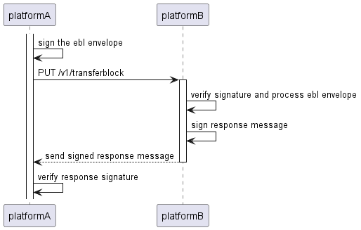

DCSA EBL Envelope
=================================================================================================================================================

# eB/L interoperability technical specifications
This document provides the technical description and specifications for transferring eBL documents between platforms using the eBL Envelope.
General concepts and backgrounds can be found [here](CONCEPTS_AND_BACKGROUND.md).
the rendered Open API specification for the is available on the [DCSA Swaggerhub](https://app.swaggerhub.com/apis/dcsaorg/DCSA_EEC/0.11-alpha).
However, for easier collaboration and the ability to add PR's and issues the resolved oas specification can be found in [here](specifications/oas/dcsaorg-DCSA_EEC-0.11-alpha-resolved.yaml).

# Open points for discussion

- [x] sha256 of the json structure is fragile. sha256 of base64 encoding is more robust (same goes for all hashes)
- [ ] should the transportdocument be sent in a separate json document and the API has the mime type that supports this?
- [x] response of the PUT transferblock is an encoded JWS with the eblEnvelopeHash signed by the receiving platform.
- [x] response of the PUT transferblock is only the string representation of the encoded JWS (no wrapper JSON object)
- [ ] transferee is represented with the [DCSA Party object](https://app.swaggerhub.com/domains/dcsaorg/DOCUMENTATION_DOMAIN/2.0.1#/components/schemas/party)
- [ ] discuss the details of platform authentication OIDC and if further specifications are required
- [ ] align on the standardized error responses

## Decision log
| Date       | Decision                                                                                                                                                  |
|------------|-----------------------------------------------------------------------------------------------------------------------------------------------------------|
| 20-07-2022 | In the initial version title and possession will be combined (=control) and transferred simultaneously                                                    |
| 20-07-2022 | Identity is transferred with internal Identifier of the platform + Platform domain (/name of platform). Formatted as an email address localid@platform.io |

## Contributing
See [the contributing guide](CONTRIBUTING.md) for detailed instructions on how to get started with our project.

# Transfering BL control to another platform
Transferring the BL control (Possession & Title) is accomplished by sending a _**"Transferblock"**_ from the sending platform to the receiving platform.

## Overview of a transferblock
A transferblock is a single JSON structure described [here](https://app.swaggerhub.com/apis/dcsaorg/DCSA_EEC/0.11-alpha#/transferblock).
The transferblock has the following structure:
* data of the B/L according to the [DCSA transportDocument specification](https://app.swaggerhub.com/domains/dcsaorg/DOCUMENTATION_DOMAIN/2.0.1#/components/schemas/transportDocument)
* The complete endorsement chain as signed eblEnvelopes transferred between platforms
  * signature of the eblEnvelope - signed with the private key of the sending platform
  * sha256 hash of the eblEnvelope
  * eblEnvelope
    * sha256 hash of the previous eblEnvelope
    * sha256 hash of the B/L data
    * list of transactions that are exported and shared between platforms

Which is depicted in this diagram:


### EBL envelope
Information regarding the B/L control (possession + title) is transferred into the EBL envelope. This envelope is signed by the sending platform.

The EBL envelope contains:
* the list of transactions that are transerred to another platform
* the hash of the B/L information (transportdocument)
* the hash of the previous ebl envelope (null if this is the first cross-platform transfer)

the EBL envelope itself is signed by the sending platform.
This **_signature_** and the **_hash of the EBL envelope_** are transferred alongside with the  EBL envelope so the receiving party can verify the received EBL envelope.

#### Transactions
A transaction inside the eblEnvelope are the representation of the transfer of control (possession + title).
Each transaction inside the transactions (list) of the EBL envelope consists of:
* **instruction** - instruction for processing the transaction: ISSU (Issue), TRNS (Transfer), SURR (Surrender), AMND (Ammend), SW2P (Switch to Paper)
* **comments** - free text comment for the party receiving the transaction
* **timestamp** - Unix epoch with millisecond precision of when the transaction was created
* **isToOrder** - indicator if the B/L is to order
* **platformHost** - base url of the platform which created the transaction
* **transferee** - Identity information about the party which controlled is transferred to see [Identity below](README.md#identity)

This results in the following JSON structure:
```json
{
  "endorcementChain": [
    {
      "signature": "eyJiNjQiOmZhbHNlLCJjcml0IjpbImI2NCJdLCJhbGciOiJIUzI1NiJ9..5rPBT_XW-x7mjc1ubf4WwW1iV2YJyc4CCFxORIEaAEk", //JWS signature of the eblEnvelope signed by the sending platform
      "envelopeHash": "20a0257b313ae08417e07f6555c4ec829a512c083f3ead16b41158018a22abe9", //sha256 hash of the eblEnvelope
      "eblEnvelope": {
        "documentHash": "76a7d14c83d7268d643ae7345c448de60701f955d264a743e6928a0b8268b24f", //sha256 of the transportdocument included in the export
        "previousEnvelopeHash": null, //sha256 hash of a previous envelopeHash. null if this is the first cross-platform export
        "transactions": [ //list of individual transactions that occurred in the platform that are exported to another platform
          {
            "instruction": "TRNS", //instruction for processing the transaction in this example transfer
            "comments": "Transfer B/L from 43549850248 on exampleplatform.com to abcdefghijk on anotherplatform.com", //free text comment
            "timestamp": 1658385166432647412, //Unix epoch with millisecond precision when the transction took place
            "isToOrder": true, //indicator of the B/L is to order
            "platformHost": "https://exampleblplatform.net", //platform where the transaction is performed
            "transferee": { //information about the transferee, in this example only the eBLPlatformIdentifier is depicted.
              "eBLPlatformIdentifier": "abcdefghijk@anotherplatform.com", //identifier of the user on the target platform and the target platform
            }
          },
          {
            "instruction": "ISSU",
            "comments": "Issue B/L to 43549850248",
            "timestamp": 1658385166302442200,
            "isToOrder": true,
            "platformHost": "https://exampleblplatform.net",
            "transferee": {
              "eBLPlatformIdentifier": "43549850248@exampleplatform.com",
            }
          }
        ]
      }
    }
  ]
}
```

## Process of transferring

Transferring a B/L between platforms consists of creating and signing the ebl Envelope and wrap it in a transferblock.
This transferblock is being send via a HTTP PUT to the receiving platform. Which is depicted in this diagram:



### Response message
The transfer operation: PUT /v1/transferblock is a synchronous operation. The the transactional integrity is maintained by the client.

In order to verify the transfer has been successful and the integrity of the message is maintained the response message is signed by the receiving party and verified by the sending party.
For more information about both the request and response signatures see the [Signatures](README.md#signatures) paragraph below

## Identity
In order to transfer the B/L to another platform identity information of the receiving party, the transferee, must be known to the sending platform.
The exchange of identities between users of platforms is out of scope for this reference implementation.
Next to exchanging the identities the identities must be formatted in a manner understandable and sharable between various platforms.

All transferee identity information is exchanged with an **_eBLPlatformIdentifier_** in combination with the [DCSA Party object](https://app.swaggerhub.com/domains/dcsaorg/DOCUMENTATION_DOMAIN/2.0.1#/components/schemas/party).

### eBLPlatformIdentifier
The eBLPlatformIdentifier is a combination of the transferee user identification _on the local platform_ and the platform.
EBLPLatformIdentifiers are formatted similar to email addresses: _**localid@platformdomain.ext**_ for example: **_gV2ZDy0jmae7@dcsaebplatform.org_**
In this example **_gV2ZDy0jmae7_** is the local identifier on the fictitious **_dcsaebplatform.org_**

### Additional identity information
While the eBLPlatformIdentifier is required, it is optional but recommended for providing additional identity information regarding the transferee.
This additional information can be used by the receiving platform to perform additional verification. For providing this additional information the DCSA Party object is used.
The DCSA Party object allows of the provision of LEI, tax reference and DID and many others documented in the [DCSA Party object](https://app.swaggerhub.com/domains/dcsaorg/DOCUMENTATION_DOMAIN/2.0.1#/components/schemas/party).

### Service discovery
The platform domain part of the eBLPLatformIdentifier being a resolvable domain name can be used for DNS based service discovery.
With this an additional TXT record can be created linking to the API endpoint providing the PUT /v1/transferblock operation.

Example:
dcsaeblplatform.org can link to a TXT record containing the full API endpoint -> api.dcsaeblplatform.org/v1/transferblocks

## Security considerations

### Transport level security
Security on the transport level requires:
* mTLS
* TLSv1.2 or TLSv1.3
* When using TLSv1.2 only Cipher suites that support [perfect forward secrecy](https://datatracker.ietf.org/doc/html/rfc5489.html)

TLSv1.3 mandates perfect forward secrecy, when using TLSv1.2 this means the usage of the following cipher suites:
* TLS_ECDHE_RSA_WITH_AES128_GCM_SHA256
* TLS_ECDHE_RSA_WITH_AES256_GCM_SHA384
* TLS_ECDHE_RSA_WITH_AES256_CBC_SHA384

### Authentication
Authentication between platforms require:
* OIDC
* Client credentials grant flow

### Signatures
The signatures used in the transfer of the B/L accross platforms have the following characteristics:
for the request message:
* signature covers the eblEnvelope json structure
* signature is created using the private key of the sending platform
* the signature is transferred as a JWS (Json Web Signature as described in [RFC 7515](https://datatracker.ietf.org/doc/html/rfc7515)) in the **_signature_** field
* the JWS is tranferred in the compact serialization format (as described in [Section 7 of RFC 7515](https://datatracker.ietf.org/doc/html/rfc7515#section-7.1))

For the response message:
* signature covers the envelopeHash of the last item in the endorcement chain
* signature is created using the private key of the receiving platform
* the signature is transferred as a JWS (Json Web Signature as described in [RFC 7515](https://datatracker.ietf.org/doc/html/rfc7515)) response body
* the JWS is tranferred in the compact serialization format (as described in [Section 7 of RFC 7515](https://datatracker.ietf.org/doc/html/rfc7515#section-7.1))

### Additional specifications and requirements around security
Digital certificate standards are a balance between information security, ease of adoption, and cost. To sign an eBL envelope with a private key of a digital certificate, the following technical minimum requirements MUST be met to guarantee trustworthy eBL envelopes:

|Category| Standard                                                             |
|---------|----------------------------------------------------------------------|
|Certificate format| X.509 (<https://www.itu.int/rec/T-REC-X.509>)                        |
|Minimum requirements signature algorithm| SHA256withRSA or SHA256withECDSA                                     |
|Minimum key length for signatures| 2048-bit RSA or 256-bit ECDSA                                        |
|Certificate revocation information method| OCSP (IETF RFC 6960)                                                 |
|Certificate validity period| Maximum of 2 years (validity MUST be part of the certificate)        |
|Signature format| See above in the **Signatures** section                                  |
|Archive period (for certificates & signatures) | Minimum of 10 Years for both sender and receiver of signed documents |
