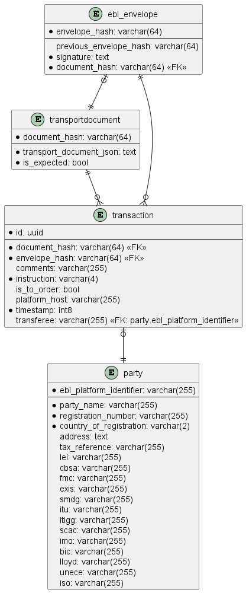

Setting up the database
=======================
The setup and configuration of the database is handled via [docker-compose](../docker-compose.yml) see the docker-compose.yml for details and the setup guide a description how to setup a working instance.

However, it is also possible to setup a standalone database instance, either via Docker or in an existing database instance.

## Setup as a standalone Docker container
In order to setup the database using Docker as a standalone docker container, in this directory issue the following commands:
```shell
docker build -t ec_registry .
```
After successful completion the container can be started with the following command:
```shell
docker run -d -p 5431:5432 -e POSTGRES_PASSWORD=change-me --name=ec_registry_standalone ec_registry
```
This results in a container named ec_registry running the configured PostgreSQL database. It is using a non-standard PostgreSQL port in order to avoid conflicts with the PostgreSQL instance started via Docker Compose.


## Setup in an existing PostgreSQL database
The reference implementation uses PostgreSQL as the underlying database. The database can be created in a running PostgreSQL database, although it is recommended to use the Docker container.

```
cd initdb.d && cat ./* | sudo -u postgres psql -f -
```

Alternatively, if you are using Windows run the following command in a Powershell window from the `initdb.d` directory (remember to replace the two placeholders in the command):

```
(Get-ChildItem ./*, -File) | Get-Content | psql -U [postgres_username] -p [port_number]
```

## Datamodel
The datamodel used in the database for this reference implementation can be depicted with the following ERD:

